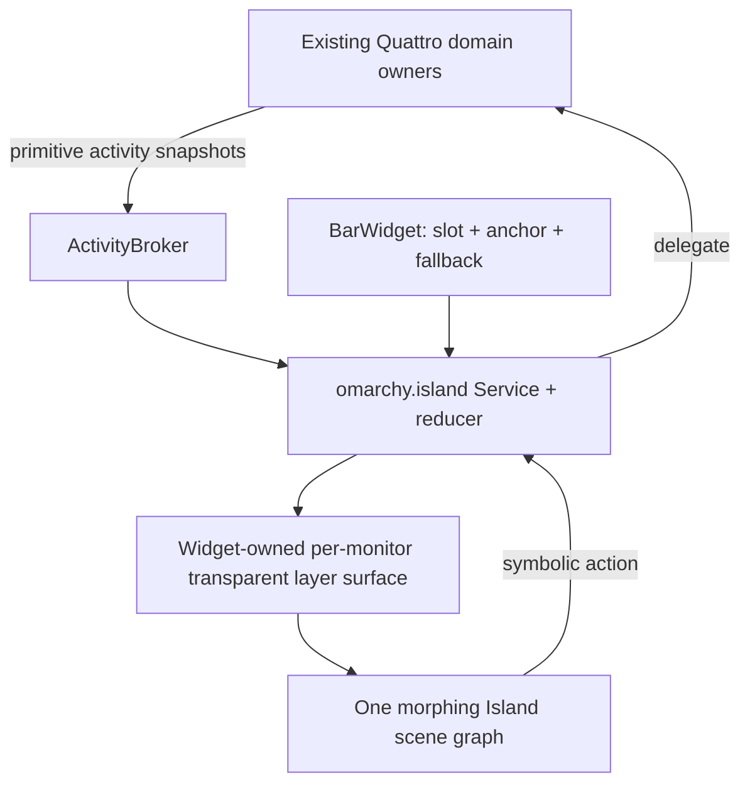

# Omarchy Island: research, architecture, and implementation plan

Status: design proposal
Target: first-party Omarchy Quattro plugin
Proposed product name: **Omarchy Island**
Proposed plugin ID: `omarchy.island`

## Executive decision

Build this inside the existing `omarchy-shell` process as one first-party Quattro plugin with `service` and `bar-widget` kinds. The keep-loaded service owns the reducer. The bar widget reserves and reports the quickbar anchor, then creates a screen-local layer-shell surface that draws the actual island over that anchor. The visible capsule should remain one scene graph while it changes between idle, compact, minimal, alerting, and expanded states. That is the only architecture considered here that can create a convincing continuous morph without replacing the user's bar or clipping the expanded view to the bar's height.

The product should emulate the iPhone Dynamic Island's visual grammar and state transitions, adapted deliberately for a desktop pointer, keyboard, multiple monitors, and configurable bar edges. It should not claim that macOS itself renders the iPhone's black capsule: current macOS presents Live Activities as a small or compact menu-bar item that opens a detail card. Apple documents that distinction in [Use Live Activities on Mac](https://support.apple.com/en-us/120684).

The core is an activity presentation system, not a second notification center and not a collection of unrelated widgets. Media, timers, recording, privacy, battery, Bluetooth, and short OSD feedback belong. Clipboard history, calendars, system monitors, launchers, terminals, and file shelves do not.

## What “1:1” means

Literal platform identity is impossible: Linux has no camera cutout, ActivityKit, iPhone sensor housing, UIKit renderer, or Apple system apps. For this project, parity should be measured against a written contract:

1. **Geometry parity.** Match Apple's documented compact, minimal, and expanded proportions in logical pixels when space permits. Use an idle capsule approximately 125 logical pixels wide and 36.67 high, a minimal bubble 36.67–45 wide, compact total width 230 or 250, and expanded width 371 or 408 with 84–160 height and a 44-point corner radius. The source is Apple's [Live Activities HIG](https://developer.apple.com/design/human-interface-guidelines/live-activities).
2. **State parity.** Implement idle, compact leading/trailing, minimal, two-activity minimal, alerting, expanded leading/center/trailing/bottom regions, and deterministic return to the prior live activity.
3. **Motion parity.** Preserve relative placement, retarget a live animation instead of closing and reopening, keep motion under two seconds, and use coordinated geometry, opacity, scale, and content movement. Apple describes the island as a unified system layer with elastic, organism-like transitions in [Design dynamic Live Activities](https://developer.apple.com/videos/play/wwdc2023/10194/).
4. **Interaction parity.** Click opens the expanded state; click again or an explicit action invokes the owner application or control. Pointer hover may preview on desktop, but it is an adaptation, not an Apple behavior. Keyboard summon, Escape, focus rings, and reduced motion are mandatory desktop additions.
5. **Content parity.** Activities have a beginning, updates, an end, compact/minimal/expanded presentations, at most a small number of essential actions, and no arbitrary application UI embedded inside them.
6. **Rendering parity.** Opaque near-black capsule, concentric rounded geometry, high-contrast content, stable margins, no “forehead” gap below a top bar, and no translucent desktop card masquerading as the iPhone treatment.

Success is therefore “perceptually and behaviorally faithful within Quattro,” not a claim of Apple implementation identity.

## What the reference projects teach us

### Atoll

[Atoll](https://github.com/Ebullioscopic/Atoll) is the richer behavioral reference. It demonstrates media, focus modes, recording and privacy state, downloads, battery, timers, gestures, hover activation, multi-screen targeting, and persistent top-edge presence. Its strongest ideas are:

- separate transient sneak peeks from persistent activities;
- retain the previous activity under a short interruption;
- target a specific screen rather than mirror an interactive expansion everywhere;
- use top-edge hover as a desktop fallback;
- keep the floating surface present across spaces and fullscreen applications.

It is not a suitable code base for Omarchy. It is Swift/AppKit, depends on macOS window behavior and Apple-only or private mechanisms, and its current central view has become a very large priority cascade with many independent observable flags. Its code is GPLv3 and its project separately identifies original assets, so the Omarchy implementation should be clean-room: study behavior, do not copy source, assets, animations, or layout code.

### DynamicIsland_Mac

[DynamicIsland_Mac](https://github.com/NKR00711/DynamicIsland_Mac) is an older, smaller fork in the same family. It is useful for understanding an early two-state `closed/open` model, auto-hide tasks, transient previews, and a floating window coordinator. It is MIT licensed, but it remains a macOS implementation and includes platform-specific screen-capture/window techniques. Copying that structure would preserve its boolean-state and timer-cancellation problems while importing the wrong platform assumptions.

### Apple sources

Apple's public references should define the clean-room behavior:

- [Live Activities HIG](https://developer.apple.com/design/human-interface-guidelines/live-activities) for layouts, sizes, actions, lifetime, color, and transition guidance;
- [DynamicIsland API](https://developer.apple.com/documentation/widgetkit/dynamicisland) for expanded regions and compact/minimal presentations;
- [Design dynamic Live Activities](https://developer.apple.com/videos/play/wwdc2023/10194/) for the visual and motion grammar;
- [iPhone Live Activity gestures](https://support.apple.com/guide/iphone/view-live-activities-in-the-dynamic-island-iph28f50d10d/26/ios/26) for expand, collapse, and switching behavior;
- [Motion](https://developer.apple.com/design/human-interface-guidelines/motion) and [Accessibility](https://developer.apple.com/design/human-interface-guidelines/accessibility) for restrained animation and reduced-motion behavior.

Official screenshots and video may be used as temporary visual-analysis references. They should not be committed as redistributable project assets.

## Native Quattro placement

Quattro already supplies the required host model: one long-running Quickshell process, first-party plugin manifests, services, bar widgets, panels, and overlays. See Omarchy's [shell documentation](https://github.com/omacom/omarchy/blob/quattro/docs/omarchy-shell.md) and [plugin README](https://github.com/omacom/omarchy/blob/quattro/shell/README.md).

The proposed manifest is:

```json
{
  "schemaVersion": 1,
  "id": "omarchy.island",
  "name": "Omarchy Island",
  "version": "1.0.0",
  "author": "Omarchy",
  "description": "Live activities attached to the Omarchy quickbar",
  "kinds": ["service", "bar-widget"],
  "keepLoaded": true,
  "entryPoints": {
    "service": "Service.qml",
    "barWidget": "BarWidget.qml"
  },
  "barWidget": {
    "displayName": "Omarchy Island",
    "category": "Status",
    "defaultSection": "center",
    "allowMultiple": false
  }
}
```

The bar widget is a native layout participant, not the primary renderer. It reserves a stable slot, reports its live anchor item and monitor to the service, participates in drag/reorder and `centerAnchor`, and provides an accessible fallback if the overlay cannot be mapped. Each eligible screen-local widget owns a transparent full-screen layer surface. Its visible child is positioned over the slot and its input mask covers only the current island bounds, allowing every other click to pass through. Quickshell supports transparent windows and input masks through [`QsWindow.mask`](https://quickshell.org/docs/v0.3.1/types/Quickshell/QsWindow/).



This explicitly rejects three tempting designs:

- A full `bar` plugin would replace the user's quickbar and inherit every bar-layout responsibility.
- A larger child inside the bar widget would clip to the bar surface or disturb its exclusive zone and neighboring modules.
- A standalone Quickshell configuration would violate Omarchy's one-shell model, duplicate data owners, and have to guess the live bar geometry.

## Geometry handoff and rendering

For a top bar, the compact slot reserves 250 logical pixels when space permits; the idle capsule is centered inside it. This prevents nearby center modules from shifting every time the island gains compact content. On constrained widths, geometry policy steps down to 230, then minimal. The visual surface tracks the slot with a live transform watcher; it must never rely on a cached global rectangle alone because scale, bar edge, monitor layout, and drag reordering can change it.

Quattro can mount a center-anchor module both as the drawn slot and as a hidden, zero-size placeholder. A widget registers a presenter only while it is visible, has nonzero width and height, belongs to a window with a live screen, and still owns the current registration token. It unregisters immediately when any condition fails or when it is destroyed. A dedicated fixture must mount the real slot and placeholder in both orders and prove there is exactly one presenter and one mapped surface per screen.

The widget-owned surface stays full-screen and transparent while loaded. Only the island child changes geometry. The layer uses no exclusive zone. Its mask follows the animated bounds. This avoids compositor window-resize artifacts and allows one QML object to animate from the compact rectangle to the expanded rectangle. It should reuse the focus-prime, immediate input release, screen fitting, popout coordination, and bar-click forwarding behavior already proven by Quattro's `KeyboardPanel`, without turning the expansion into a separate fixed card.

At the beginning of a morph:

1. the overlay child exactly covers the bar slot's visible capsule;
2. the bar fallback paint becomes transparent but retains layout size;
3. width, height, radius, and content regions retarget on the overlay;
4. on collapse, the overlay returns to the latest anchor rectangle before the bar fallback becomes visible.

Top grows down, bottom grows up, left grows right, and right grows left. The Apple-faithful top layout is the launch target. Bottom and side bars are supported adaptations and must never be called pixel-identical. On left/right bars, the first release may retain compact status and open a conventional adjacent card until a tested vertical motion language exists.

## Domain model

The island must be driven by a reducer, not by independent `expanded`, `hovered`, `showMedia`, `showTimer`, and `showVolume` flags.

```text
Activity {
  id, source, kind, revision,
  priority, relevance, createdAt, updatedAt, expiresAt,
  target: focused | screen(name) | all,
  privacy: public | sensitive,
  compactLeading, compactTrailing, minimal,
  expanded: { leading, center, trailing, bottom },
  actions: [{ id, label, role, enabled }]
}

Presentation = idle
             | compact(primary)
             | minimal(primary, secondary?)
             | alerting(transient, underlying?)
             | expanded(selected, reason)
             | settling(target)

Command = publish(activity)
        | update(source, id, revision, patch)
        | end(source, id, dismissal)
        | expand(id, screen, reason)
        | collapse(reason)
        | invoke(id, actionId)
```

All payloads crossing the broker are primitives and immutable snapshots. The broker validates identity, times, progress, allowed presentation fields, action count, and maximum text/artwork sizes. No `QObject`, function, or backend reference enters the reducer. Actions are symbolic and are delegated back to the authoritative owner.

Priority is a policy function, not a view cascade. A suitable first policy is:

1. active privacy/recording and critical safety state;
2. user-pinned or explicitly expanded activity;
3. imminent timer/reminder;
4. short OSD or device-transition pulse;
5. active call/navigation publisher when those exist;
6. media;
7. ordinary background activity.

Within a class, sort by relevance, last update, then stable key. An interrupting pulse gets a bounded presentation lease and then restores the live underlying activity. A monotonically increasing token cancels stale timers and close callbacks. When two ongoing activities exist, the second uses the detached minimal bubble rather than being discarded.

## Ownership and data sources

The island is a presenter and arbiter. Existing first-party components remain domain owners:

| Activity | Source of truth | Initial behavior |
| --- | --- | --- |
| Media | `omarchy.media` MPRIS/PipeWire service | Compact art/status; expanded title, artist, progress, previous/play/next; open existing media source picker. |
| Volume/brightness | Existing OSD producers | Publish a coalesced, short progress pulse; retain current OSD as fallback when island is disabled or unavailable. |
| Battery/power | `omarchy.battery`/UPower | Charging connection, low battery, full charge; no duplicate polling. |
| Timer/reminder | Existing `omarchy-reminder`/systemd contract | Ongoing countdown, expiry pulse, stop/open action. |
| Bluetooth | Existing Bluetooth panel/BlueZ state | Device connected/disconnected and battery pulse; open existing panel for management. |
| Microphone | Existing PipeWire input-stream logic | Persistent privacy indicator only for what the current source can prove. |
| Screen recording | Existing Omarchy recording indicator | Persistent recording activity and stop action for the owned recorder. |
| Notifications | Existing `NotificationServer` | Only explicitly projected time-sensitive activities; no history, DND, or daemon duplication. |

The current OSD is presentation-only and has no shared event stream, so it needs a narrow publish seam. Some indicators currently collect state once per bar/monitor; those collectors should be hoisted into same-domain services before island integration to avoid per-monitor polling. Camera-in-use and arbitrary portal screen sharing must not ship until Omarchy has a reliable owner. The current microphone and `gpu-screen-recorder` signals do not prove camera or general capture use.

Third-party publishers should eventually use a small IPC surface:

```text
omarchy-shell island publish '<validated JSON>'
omarchy-shell island update  '<validated JSON>'
omarchy-shell island end     '<source> <id>'
omarchy-shell island state
```

IPC is a later phase, after the internal contract is stable. It needs per-source rate limits, payload caps, safe URL/image handling, and no arbitrary command actions.

## Visual and motion system

Use original Omarchy drawing primitives and installed iconography. Do not ship SF Symbols, San Francisco fonts, Apple UI kits, Atoll assets, or traced Apple paths.

Core tokens:

- background: opaque `#000000` by default;
- foreground: high-contrast white, with source color used sparingly for identity/progress;
- margins: optically even and concentric with the capsule radius;
- compact height: 36.67 logical pixels at scale 1, adjusted only to fit an undersized bar;
- idle width: approximately 125.34; compact width: 230/250; minimal: 36.67–45;
- expanded: 371/408 wide, 84–160 high, 44 radius, clamped to screen safe margins;
- open spring prototype: approximately 340–420 ms with high damping;
- content replacement: approximately 220–340 ms;
- close: approximately 300–450 ms with no input retained during the fade;
- every complete system animation remains below Apple's two-second guidance.

QtQuick `SpringAnimation` or carefully tuned `NumberAnimation` should be prototyped against frame pacing. Retargetable width/height/x/y/radius animations matter more than decorative shader effects. Avoid blur and custom shaders in v1. Artwork uses an asynchronous image loader, bounded decode sizes, and a placeholder color sampled or supplied by the media owner.

Reduced motion snaps geometry or uses a very short opacity transition, disables scale, bounce, marquee, and repeated pulses, and keeps all state information visible. Screen-reader names must describe the selected activity, progress, privacy state, and every action. Icon color is never the only signal.

## Interaction contract

- Click compact: expand the selected activity on that monitor.
- Click primary compact content: configurable; default to expand, not invoke an irreversible action.
- Hover: after a short dwell, optionally enter a desktop preview; leaving cancels only if focus or pointer is not inside the expanded card.
- Scroll over media/progress: no hidden destructive behavior. Volume scroll may be allowed only when the active content is explicitly volume.
- Escape/outside click: collapse and release input immediately; the destination click should reach the underlying application where compositor semantics permit.
- Keyboard summon: target the focused monitor, briefly acquire the layer-shell focus needed to seed keyboard navigation, then return to on-demand focus.
- Shell control: expose `open()`, `close()`, and `opened` on the widget so Quattro's existing `summon`, `hide`, and `toggle` paths continue to target the focused monitor and coordinate with other bar popouts.
- Tab/Shift-Tab: traverse actions; arrows navigate regions; Enter/Space activate; visible focus rings are mandatory.
- Two activities: show primary compact plus secondary minimal bubble; click or horizontal wheel switches selection. Touch-only swipe gestures are not required on a desktop.
- Lock screen, monitor removal, plugin disable, or owner removal: collapse safely, unregister the anchor, and retain no stale input surface.

Compact state may appear on every configured bar, but one expanded activity has one owning monitor. A focused-monitor event targets that monitor. If its anchor disappears, an interactive expansion collapses instead of teleporting to another display. A new passive alert may retarget to the focused registered anchor. Interactive cards are never mirrored across displays.

## Proposed source layout

```text
shell/plugins/island/
  manifest.json
  Service.qml
  ActivityModel.js
  Geometry.js
  Motion.qml
  BarWidget.qml
  IslandSurface.qml
  IslandContent.qml
  views/
    Idle.qml
    Compact.qml
    Minimal.qml
    Alerting.qml
    Expanded.qml
  adapters/
    MediaAdapter.qml
    BatteryAdapter.qml
    ReminderAdapter.qml
    BluetoothAdapter.qml
    PrivacyAdapter.qml

shell/services/
  ActivityBroker.qml
```

Adapters subscribe to existing services or broker projections; they do not become new source owners. `ActivityModel.js` and `Geometry.js` stay pure enough for Node tests. QML components render normalized state and contain no priority logic.

## Delivery plan

### Phase 0 — settle the risky surface

Prototype three shapes in a disposable branch/VM using synthetic activities:

1. persistent overlay renderer aligned to a transparent bar slot;
2. compact renderer in the bar plus an overlay takeover during expansion;
3. existing `PopupCard`/`KeyboardPanel` expansion from a normal widget.

Measure anchor drift, first-frame flash, input masking, keyboard focus, compositor frame pacing, and monitor-scale changes. Select the persistent overlay only if it proves stable; otherwise accept the takeover crossfade and document the small discontinuity. This is the major unknown and should be answered before domain integration.

Exit gate: recorded top-bar morph on one and two monitors, no click interception outside the card, no bar layout movement, and a written architecture decision record.

### Phase 1 — plugin shell, model, and synthetic fixture

- Add the multi-kind manifest, keep-loaded service, activity broker, pure reducer, geometry policy, stable bar slot, and panel surface.
- Add an internal fixture command that publishes deterministic idle, compact, minimal, two-activity, alerting, and expanded samples.
- Implement focus, input mask, screen selection, monitor removal, bar-edge handling, and reduced motion before real providers.

Exit gate: reducer/geometry tests, manifest validation, QML lint, top/bottom/side fixture captures, and clean shell teardown.

### Phase 2 — media vertical slice

- Project `omarchy.media` into the activity contract without adding another MPRIS or PipeWire owner.
- Implement artwork, playback state, progress, controls, source identity, and owner-delegated actions.
- Preserve the current media widget and selector; enabling the island must not silently remove them.

Exit gate: play/pause/seek/track replacement behavior, multiple-player selection parity with the existing media service, stale artwork cancellation, and live visual recording.

### Phase 3 — transient system feedback

- Add a shared event seam to OSD producers and retain the existing OSD fallback.
- Implement coalesced volume and brightness pulses, charging, low battery, Bluetooth connection, and reminder expiry.
- Ensure a transient event restores the prior media/timer activity.

Exit gate: burst/rate-limit tests, stale-timer cancellation, fallback behavior when the island is disabled, and no duplicate polling.

### Phase 4 — ongoing and privacy activities

- Hoist per-monitor reminder/recording/microphone collectors into shared same-domain services where necessary.
- Implement timer/reminder countdowns, owned screen recording, microphone-in-use, and dictation if its current owner exposes a reliable state.
- Do not add camera or generic screen-sharing claims without a trustworthy portal/PipeWire owner.

Exit gate: one collector per domain, persistent activity restoration, privacy accessibility labels, owner teardown, and lock-screen behavior.

### Phase 5 — publisher API and first-party hardening

- Freeze and document the validated activity schema and IPC commands.
- Add payload/rate/image limits, symbolic actions, source replacement keys, expiry policy, and compatibility versioning.
- Add opt-in example publishers for calls/navigation/downloads without placing those domains in the core plugin.

Exit gate: malformed/untrusted payload suite, IPC compatibility tests, documentation examples, and denial-of-service budgets.

### Phase 6 — upstream integration and rollout

- Ship as a bundled first-party plugin, initially opt-in.
- Add it to fresh-install center layouts only after visual acceptance. Do not rewrite existing customized bars.
- If a migration is desired, insert once only when the entire affected section still matches the previous stock layout; never steal an existing custom `centerAnchor`.
- Decide later, with usage evidence, whether Omarchy Island replaces any current default OSD or indicator presentation.

Exit gate: full `./test/shell`, graphical acceptance VM, package upgrade/rollback tests, documentation, and explicit maintainer product approval.

## Verification contract

Source checks are necessary but insufficient. The final implementation needs:

- unit tests for validation, ordering, replacement, coalescing, expiry, restoration, stale callbacks, actions, monitor failover, and every geometry edge;
- contract tests loading every manifest entry point and proving one broker/service instance;
- compositor fixtures proving the compact slot contributes stable layout size, the island exceeds bar height without clipping, and the bar exclusion zone never changes;
- checks that there is still exactly one notification server, media owner, battery watcher, Bluetooth scanner, reminder owner, recording probe, and microphone owner;
- fallback tests for plugin absent, disabled, crashed, hidden with the bar, or used with a custom bar;
- fresh visual captures at 1920×1080 scale 1, 2560×1440 fractional scale, and 4K scale 2; single and dual monitor; top, bottom, left, and right bars; fullscreen application; hotplug; reduced motion;
- recorded open, retarget, interruption, two-activity, action, and close transitions after the last visual change;
- QML profiler evidence during idle, continuous media progress, and bursty OSD input.

Suggested budgets, to be confirmed by prototype baseline:

- no polling added for a domain that already has a reactive owner;
- idle CPU attributable to the plugin below 0.5% on the reference host;
- no sustained frames over the 16.7 ms budget during a 60 Hz morph;
- animation duration under two seconds, with the normal open/close sequence substantially shorter;
- bounded image decode/cache memory and no growth across 1,000 synthetic activity replacements;
- no input region outside the current visible island bounds in passive states.

Manual visual acceptance remains separate from automated proof. The reviewer should compare geometry and timing against a temporary reference atlas, mark each state `PASS`, `REVISE`, or `BLOCK`, and inspect fresh screenshots and video rather than source alone.

## Legal and naming boundary

“Dynamic Island” is listed by Apple as a registered trademark on its [trademark list](https://www.apple.com/legal/intellectual-property/trademark/appletmlist.html). The shipped feature should therefore use the distinctive name **Omarchy Island**, with “inspired by the Dynamic Island interaction model” only as descriptive documentation language and with an appropriate Apple non-affiliation notice. This is risk reduction, not legal advice.

Apple's design resources license limits use of those resources to mockups for software running on Apple operating systems; see the [Apple Design Resources License](https://developer.apple.com/support/downloads/terms/apple-design-resources/Apple-Design-Resources-License-20230621-English.pdf). The Linux plugin must use original code, shapes, icons, fonts, screenshots, and artwork. Atoll behavior may inform the product analysis, but its GPLv3 code and separately identified assets should not enter the MIT-licensed Omarchy tree. If exact trade-dress duplication remains a release requirement, obtain counsel before publication.

## Decisions still requiring prototype evidence

1. Whether a persistent full-screen transparent surface has acceptable idle cost and compositor behavior on all supported GPUs.
2. Whether an outside click can both collapse the masked layer surface and reach the underlying application. A card-only input mask cannot observe that click, while a full-screen dismissal mask may consume it.
3. Whether the bar reserves 250 logical pixels permanently or uses a narrower stable idle slot plus controlled neighbor movement.
4. Whether bottom/side bars receive an adapted expansion or compact-only fallback in v1.
5. Whether normal notification projections add value or merely duplicate the existing notification experience.
6. Whether hover preview improves desktop use without creating accidental activation.
7. Whether the plugin is opt-in only or part of new-install defaults after upstream review.

None of these requires changing the activity model or ownership boundaries. That is the sign that the architecture has isolated the uncertain presentation choices correctly.

## Definition of done

The work is complete only when the first-party plugin is bundled in Omarchy Quattro, uses the existing shell process and domain owners, occupies a native quickbar slot, morphs without clipping or layout shift, handles multi-monitor and bar-edge lifecycle safely, passes shell and contract tests, has fresh rendered evidence at the required scales, meets measured idle/frame budgets, includes reduced-motion and keyboard behavior, retains fallbacks, documents its publisher contract, and has explicit manual approval for the subjective visual match.
